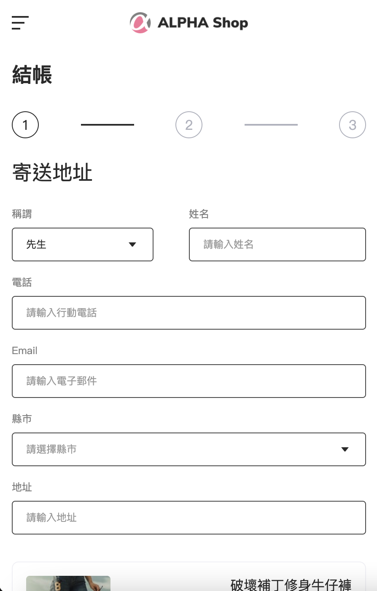
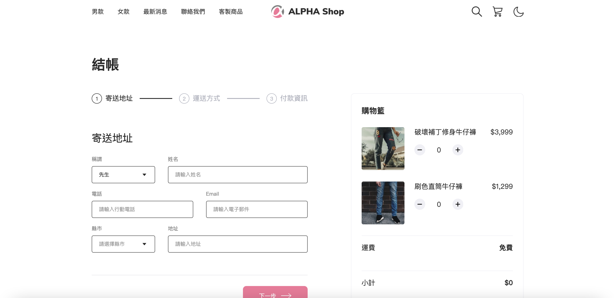
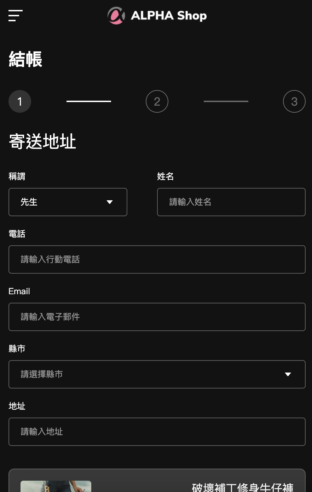
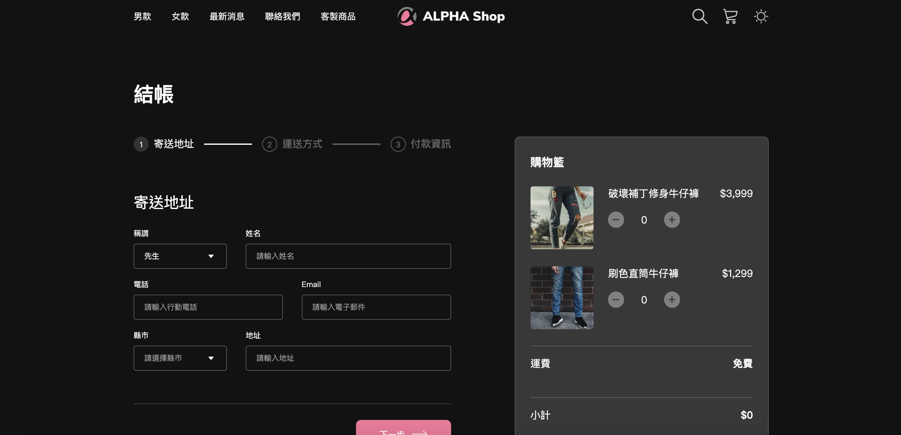

# alpha-shop-cart
This project is my recent practice for using SCSS to layout a shop cart called alpha shop. 
And also, I try to practice webpack for bundling whole my scss, javascripts files. 
It takes time to have research about how to use webpack. 
And I have increase dark mode toggle to it. 

## Images
### Small-size

### Large-size

### Small-size-dark-mode

### Large-size-dark-mode

## How to use it.